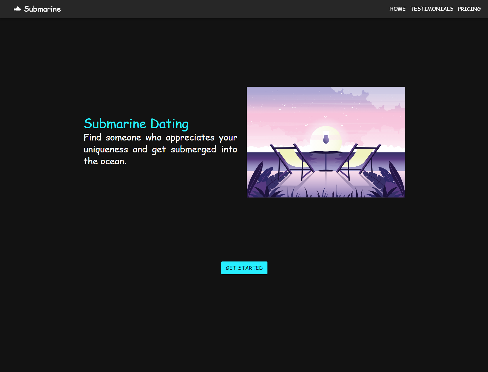
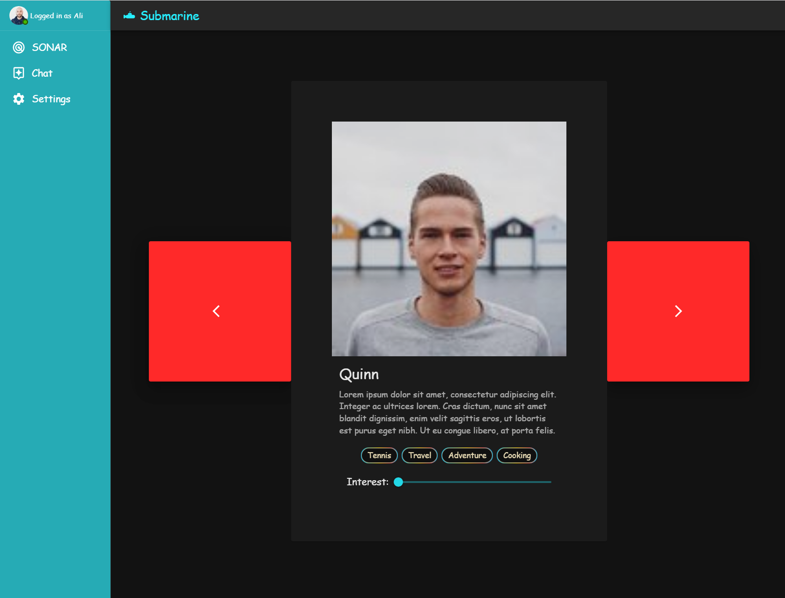

This is a [Next.js](https://nextjs.org/) project bootstrapped with [`create-next-app`](https://github.com/vercel/next.js/tree/canary/packages/create-next-app).

## Try the App

You can visit the deployed app here: [Submarine Dating](https://dating-app-six.vercel.app/)

### Landing Page



### Application Page




As you can see you can swipe on potential connections based on interest.

## Code structure
```
.
├── middleware/
│   └── middleware for next
├── pages/
│   ├── api/
│   │   └── ...endpoints
│   └── ...routes
├── public/
│   └── ...assets (e.g svg, img)
├── src/
│   ├── backend/
│   │   └── ...algorithms for the backend
│   ├── components/
│   │   └── ...simple components
│   ├── contexts/
│   │   └── ...Context API
│   ├── controllers/
│   │   └── ...Data interactive
│   ├── hooks
│   ├── layouts/
│   │   └── ...web section layouts
│   ├── tools
│   └── views/
│       └── ...advanced render functions
└── styles/
    └── ...style modules

```

## Libraries

- **MUI**: Material UI as design foundation.
- **Emotion**: Dependency for Styling with MUI.
- **SVGR**: SVG file loading.
- **Classnames**: To pass multiple classnames to components.
- **Dotenv**: Environment variables.
- **Framer-motion**: Animation.
- **Mongodb**: NoSQL db.
- **Next-connect**: Middleware and better endpoints.
- **Next-SEO**: Search engine optimization.
- **node-fetch**: Fetch on the backend.

## Get involved

First, run the development server:

```bash
npm run dev
# or
yarn dev
```

Open [http://localhost:3000](http://localhost:3000) with your browser to see the result.

## Requirements

- [x] The app needs to have multiple pages and use client-side routing
- [x] The app should make use of the Context API or use custom hooks
- [x] You can use an API that you have built
- [x] You should not use class components
- [x] Follow the guidelines for technical assignments

### Bonus

- [x] Having a backend

